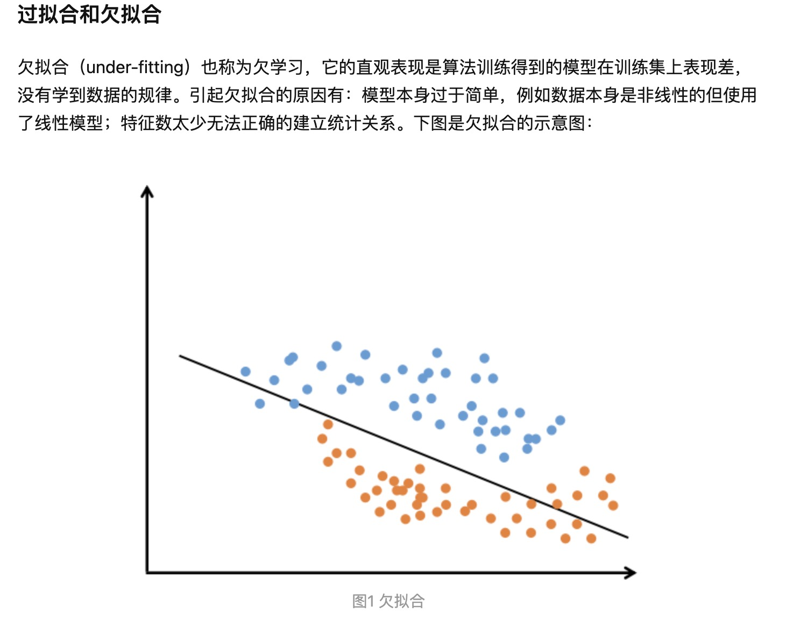

# 📠 Machine Learning

## 机器学习与人工智能 

* 人工智能(Artificial Intelligence, AI)是研究计算机模拟人的某些思维过程和智能行为(如学习、推理、思考、规划等)。主要包括计算机实现智能的原理、制造类似于人脑智能的计算机，使计算机能实现更高层次的应用。
* 机器学习(Machine Learning, ML)是人工智能的分支。机器学习方法利用既有的经验，完成某种既定任务，并在此过程中不断改善自身性能。**通常按照机器学习的任务，将其分为有监督的学习(Supervised Learning)、无监督的学习(Unsupervised Learning)两大类方法。**

### **有监督的学习(Supervised Learning)**

* 有监督的学习**利用经验**(历史数据)，学习表示事物的模型，关注**利用模型预测未来数据**，一般包括：<mark style="background-color:yellow;">分类问题</mark>(Classification)<mark style="background-color:yellow;">和回归问题</mark>(Regression)。
  1. 分类问题是对**事物所属类别的判别**，类型的数量是已知的。例如，识别鸟，根据鸟的身长、各部分羽毛的颜色、翅膀的大小等多种特征来确定其种类；垃圾邮件判别，根据邮箱的发件、收件人、标题、内容关键字、附件、时间等特征决定是否为垃圾邮件。
  2. 回归问题的预测目标是**连续变量**。例如，根据父、母的身高预测孩子的身高；根据企业的各项财务指标预测其资产收益率。

### **无监督的学习(Unsupervised Learning)**

* 无监督的学习倾向于**对事物本身特性的分析**，常见问题包括 **数据降维(Dimensionality Reduction)和聚类问题(Clustering)**。
  1. 数据降维是**对描述事物的特征数量进行压缩的方法**。例如，描述学生，记录了每个人的性别、身高、体重、选修课程、技能、业余爱好、购物习惯等特征。面向特定的分析目标职业生涯规划，只需选取与之相关的特征进行分 析，**去掉无关数据**，**降低处理的复杂度**。
  2. 聚类问题的目标也是**将事物划分成不同的类别**，与分类问题的不同之处是事先并不知道类别的数量，它根**据事物之间的相似性，将相似的事物归为一簇**。例如，电子商务网站对客户群的划分，将具有类似背景与购买习惯的用户视为异类，即可有针对性地投放广告。

## 机器学习模型的泛化 

#### 经验误差与泛化误差 

经验误差，即训练误差，是指学习器在训练集上的误差。

与之相对的，学习器在新样本上的误差被称为**泛化误差**。

对于深度学习或机器学习模型而言，我们不仅要求它对训练数据集有很好的拟合（训练误差），同时也希望它可以对未知数据集（测试集）有很好的拟合结果（泛化能力），所产生的测试误差被称为泛化误差。度量泛化能力的好坏，最直观的表现就是模型的**过拟合**（overfitting）和**欠拟合**（underfitting）

#### Over- fitting（过拟合）定义

**过拟合是指模型只过分地匹配特定数据集，以至于对其他数据无良好地拟合及预测。**

我们可以将"⼀个模型在训练数据集上的效能“想象成⼀个学⽣在模拟考试中的分数“。这个分数⽤来为⼀些真正的期末考试做参考，即使模拟成绩很不错，也不能保证期末考试成功。

换⾔之，测试性能可能会显著偏离训练性能。当⼀个模型**在训练集上表现良好**，**但不能推⼴到测试集时**，我们说这个模型是“过拟合”（overfitting）的。

就像在现实⽣活中，尽管模拟考试考得很好，真正的考试不⼀定百发百中。

#### **为什么会出现过拟合（over-fitting）现象？**

1、**训练数据集样本单一，样本不足**。如果训练样本只有负样本，然后那生成的模型去预测正样本，这肯定预测不准。所以训练样本要尽可能的全面，覆盖所有的数据类型。\
2、**训练数据中噪声干扰过大**。噪声指训练数据中的干扰数据。过多的干扰会导致记录了很多噪声特征，忽略了真实输入和输出之间的关系。\
3、\*\*模型过于复杂。\*\*模型太复杂，已经能够“死记硬背”记下了训练数据的信息，但是遇到没有见过的数据的时候不能够变通，泛化能力太差。我们希望模型对不同的模型都有稳定的输出。模型太复杂是过拟合的重要因素。

### 模型表现结论

## 线性回归/逻辑回归模型

check more deatils below ：]


[stat.md](stat.md)


## 机器学习评估指标大全: 

### 分类问题: 

我们有10张照片，5张男性、5张女性

会有四种情况，构成了混淆矩阵

TP – True Positive：实际为男性，且判断为男性（正确）

FN – False Negative：实际为男性，但判断为女性（错误）

TN – True Negative：实际为女性，且判断为女性（正确）

FP – False Positive：实际为女性，但判断为男性（错误）

### 分类评估指标详解 

准确率 – Accuracy

预测正确的结果占总样本的百分比，公式如下：

**准确率 =(TP+TN)/(TP+TN+FP+FN)**

> 虽然准确率可以判断总的正确率，但是在**样本不平衡** 的情况下，并不能作为很好的指标来衡量结果。举个简单的例子，比如在一个总样本中，正样本占 90%，负样本占 10%，样本是严重不平衡的。对于这种情况，我们只需要将全部样本预测为正样本即可得到 90% 的高准确率，但实际上我们并没有很用心的分类，只是随便无脑一分而已。这就说明了：**由于样本不平衡的问题，导致了得到的高准确率结果含有很大的水分。即如果样本不平衡，准确率就会失效。**

精确率（差准率）- Precision

所有被预测为正的样本中实际为正的样本的概率，公式如下：

**精准率 =TP/(TP+FP)**

> 精准率和准确率看上去有些类似，但是完全不同的两个概念。精准率代表对正样本结果中的预测准确程度，而准确率则代表整体的预测准确程度，既包括正样本，也包括负样本。

召回率（查全率）- Recall

实际为正的样本中被预测为正样本的概率，其公式如下：

**召回率=TP/(TP+FN)**

**召回率的应用场景：** 比如拿网贷违约率为例，相对好用户，我们更关心坏用户，不能错放过任何一个坏用户。因为如果我们过多的将坏用户当成好用户，这样后续可能发生的违约金额会远超过好用户偿还的借贷利息金额，造成严重偿失。**召回率越高，代表实际坏用户被预测出来的概率越高，它的含义类似：宁可错杀一千，绝不放过一个。**

_F1分数_

**精确率和召回率的平衡点**

**F1=(2×Precision×Recall)/（Precision+Recall）**

## Bayes Theorem:

Bayes Theorem is a fundamental concept in probability theory and machine learning that helps us understand how the probability of an event changes when we have new information. In simple terms, it tells us how likely something is to happen, given some evidence we already know.

Bayes Theorem is a mathematical formula that allows us to update our initial guess (called the **prior probability**) with new evidence (called the **likelihood**) to arrive at a more accurate prediction (called the **posterior probability**). In machine learning, it's often used for classification tasks, like identifying spam emails or detecting diseases from medical tests, where we want to predict a category based on some observed features.

Let's use some mock data to calculate probabilities for the spam email example:

1. Define events A and B:
   * A: An email is spam.
   * B: The email contains the word "free".
2. Calculate probabilities using mock data:
   * P(A): The probability that an email is spam. Suppose 60% of emails are spam in our dataset.
   * P(B): The probability that an email contains the word "free". Suppose 20% of emails contain the word "free" in our dataset.
   * P(B | A): The probability that an email contains the word "free", given that it's spam. Suppose 50% of spam emails contain the word "free" in our dataset.
3. Apply Bayes Theorem to calculate P(A | B): P(A | B) = (P(B | A) \* P(A)) / P(B) P(A | B) = (0.5 \* 0.6) / 0.2 P(A | B) = 0.3 / 0.2 P(A | B) = 1.5

Since probabilities can't be greater than 1, we must have made an error in our mock data. In reality, these probabilities should be consistent, and such a situation shouldn't arise. Ensure that the probabilities you use are accurate and coherent.

Now, let's consider the medical test example:

1. Define events A and B:
   * A: A person has the disease.
   * B: The person's test result is positive.
2. Calculate probabilities using mock data:
   * P(A): The probability that a person has the disease. Suppose the disease has a prevalence rate of 1% (0.01) in the population.
   * P(B): The probability that a person's test result is positive. Suppose 5% of test results are positive in our dataset.
   * P(B | A): The probability that a person's test result is positive, given they have the disease. Suppose the test's sensitivity is 95% (0.95).
3. Apply Bayes Theorem to calculate P(A | B): P(A | B) = (P(B | A) \* P(A)) / P(B) P(A | B) = (0.95 \* 0.01) / 0.05 P(A | B) = 0.0095 / 0.05 P(A | B) ≈ 0.19

In this example, P(A | B) ≈ 0.19 means that there's a 19% chance that a person has the disease, given that they have a positive test result. This helps us understand the true likelihood of having the disease despite a positive test result, considering the disease prevalence and test sensitivity.

\

\
\
