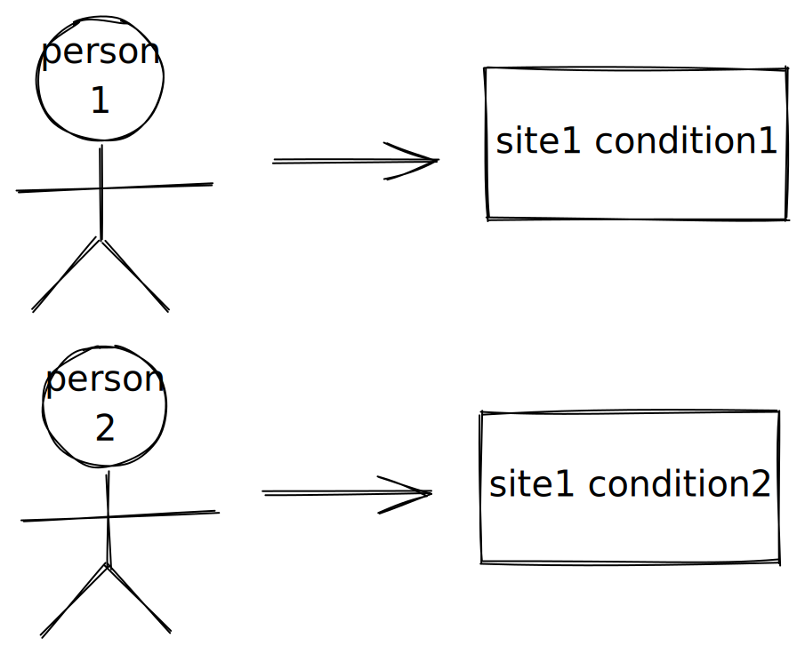

# human-centered design

### **Within-subject Design:**

**\*The same participant tests all conditions corresponding to a variable**

****

### **Between-subject Design:**

****

**Differnt participants are assigned to different conditions corresponding to a variable.**

****

### **Experimental Design:**

**The process of choosing how to run an experiment to answer the research question**

****

### **Split-plot Design:**

**HCI Reseach Bias comes from：**

* **instrucments(measurements)**
* **experimental procedures**
* **participants**
* **experimenter behavior**
* **environment factor**
